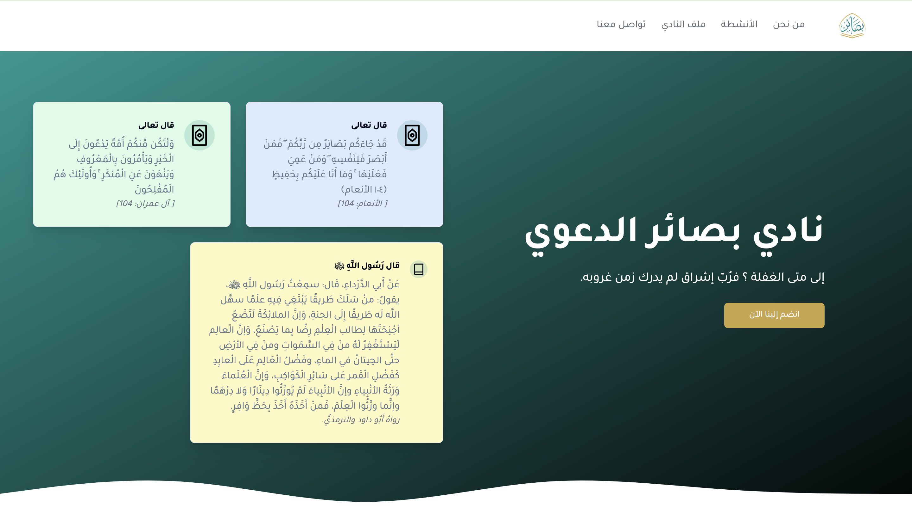

# 📚 Basair Club Landing Page

Welcome to the Basair Club landing page repository! This project represents the online presence of the Basair Club, a religious and educational organization based at the National School of Applied Sciences in Tangier.

## 🌟 About Basair Club

**Basair Club** is a student-run religious and educational club dedicated to promoting Islamic values and knowledge among engineering students. Our mission is to organize various activities, including religious lectures, study circles, and community service projects, to help students strengthen their faith and understanding of Islam.

### 🎯 Our Goals

- **🌱 Spiritual Growth**: We aim to provide a platform for students to deepen their understanding of Islam and strengthen their connection with their faith.
- **📚 Educational Activities**: Through lectures, workshops, and study sessions, we help students gain essential knowledge about their religion.
- **🤝 Community Building**: We foster a supportive community where students can find like-minded peers who share their values and goals.

### 🤗 Join Us

We encourage all students at the National School of Applied Sciences in Tangier to get involved with Basair Club. Whether you're looking to learn more about Islam, meet new friends, or contribute to the community, there's a place for you in our club.

---

For more information or to get involved, please visit our website or contact us directly.

---

_This project is proudly maintained by Basair Club. All rights reserved._
